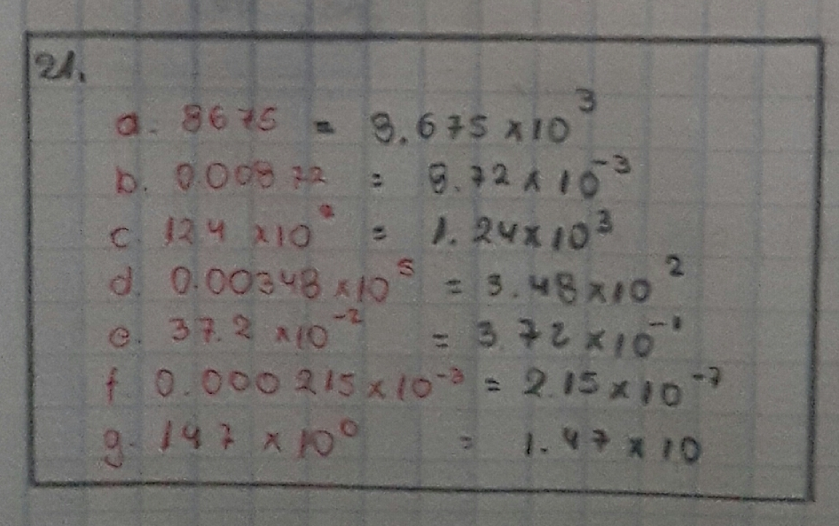
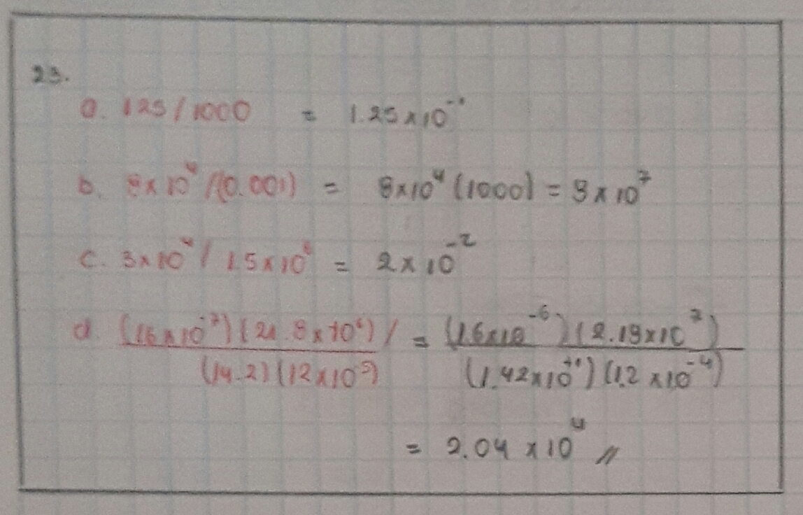
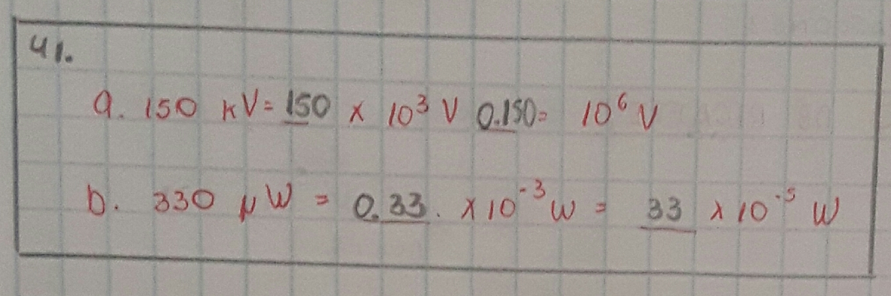

# INFORME-TAREA-1
Integrantes: Chachalo Mayerli, Mensias Adrian, Robalino Johanna, Keily Vallejo

1. OBJETIVOS

**OBJETIVOS GENERALES**

-Estudiar y analizar componentes de un circuito eléctrico, su comportamiento en base de leyes, principios, conceptos y métodos de análisis mejor conocidas como teoría del circuito, esta teoría nos ayudara a lo largo de la tarea calculando valores para voltaje, corriente y potencia, incluyendo su respectiva unidad de medida. 

-Comprender la estructura de un circuito eléctrico básico  el cual se debe componer por una fuente de energía eléctrica que permitirá el funcionamiento del circuito eléctrico, un interruptor el cual realiza la función de abrir o cerrar el paso de energía desde la fuente, una carga eléctrica y cables de interconexión que son los conectores entre los diferentes aparatos del circuito.

**OBJETTIVOS ESPECÍFICOS**

Explicar y describir  la fuerza fundamental coulumb 

Analizar la corriente como un movimiento de carga

Reconocer los diferentes materiales y sus características que hacen que estos sean conductores, aislantes y semi conductores.

Resolver los ejercicios al final de cada capitulo estudiado.

2. MARCO TEÓRICO

3. EXPLICACIÓN Y RESOLUCIÓN DE EJERCICIOS O PROBLEMAS
   EJERCICIOS IMPARES CAPÍTULO 1
   
 1.- Realice las siguientes conversiones:
 
   a.	27 minutos a segundos
   
      Un minuto equivale a 60 segundos. 
      27 (min) x 60 (s) = 1620 segundos
   b. 0.8 horas a segundos 
   
      Una hora tiene 3600 segundos.
      0.8 (h) x 3600 (s)= 2880 segundos
   c. 2 (h) 3 (min) 47 (s) a (s)
   
      2 horas tienen 7200 segundos
      3 minutos tiene 180 segundos 
      7200(s)+180(s)+47(s)= 7427 segundos
   d. 35 caballos de potencia a watts
   
      Un caballo de fuerza (hp) tiene 745.7 watts
      35 caballos x 745.7 watts= 26 110 W
   e. 1827 W a hp 
   
      1827 W x 1 hp/ 745.7 W = 2.45 hp
   f. 23 revoluciones a grados
   
      Una revolución tiene 360°
      23 revoluciones x 360° = 8280°
   3.-Establezca los factores de conversión, calcule lo siguiente y exprese la respuesta en las unidades que se indican.
   
   a. El área de una placa de 1.2 m por 70 cm en m^2.
   
      Fórmula del área de un rectángulo: largo x ancho
      70 cm a m= 0.7 m
      A=1.2 m x 0.7 m = 0.84 m^2
   b. El área de un triángulo con 25 cm de base, altura 0.5 m en m^2.
   
      Fórmula del área de un triángulo= (base x altura)/2
      25cm a m= 0.25 m
      A= (0.25 x 0.5)/2 = 0.0625 m^2
   c. El volumen de una caja de 10 cm por 25 cm por 80 cm en m^3.
   
      10 cm en m = 0.1 m 
      25 cm en m = 0.25 m
      80 cm en m = 0.8 m
      Volumen de un = alto x ancho x largo 
      0.1 (m) x 0.25 (m) x 0.8 (m) = 0.02 m^3
   d. El volumen de una esfera de 10 pulgadas de radio en m^3.
   
      39.37 pulgadas equivale a un metro.
      10 (in) x  1 (m)/39.37(in)= 0.254 metros
   5.-Si la máquina robot de montaje superficial de la figura 1-3 coloca 15 partes cada 12 s, ¿cuál es su tasa de colocación por hora?
  
      En 12 segundos coloca 15 partes. Si se hace una regla tres, se tiene que que una hora tiene 3600 segundos. 
      Tasa de colocación= (3600 segundos x 15 partes)/12(s) = 4500 partes por hora .
      
   7.- Un auto tiene un rendimiento de 27 millas por galón (E. U.). ¿Cuál es el rendimiento en kilómetros por litro?
   
       Un galón equivale a 3.785 litros. 
       Una milla en kilómetros es 1.609. 
       
   
  
   9.- Una rueda gira 18° en 0.02 s. ¿A cuántas revoluciones por minuto equivale esta cantidad?
   
        Se realiza conversión de grados a radianes para luego calcular a cuantas revoluciones por minuto equivale. 
       
   
      
   11.- Se define la ecuación s = vt, donde s es la distancia recorrida, v es la velocidad y t es el tiempo. Si usted viaja a v = 60 mph por 500 segundos, obtiene y sustituye sin pensar s = (60) (500) 30 000 millas. ¿Cuál es el error en este cálculo? ¿Cuál es la respuesta correcta?
      
     Se debía convertir los segundos a horas. 
   
   
      
   13.- A Joe S. se le pidió convertir 2000 yd/h en metros por segundo. Aquí está el trabajo de Joe: velocidad 2000 0.9144 60/60 1828.8 m/s. Determine los factores de    conversión, escriba las unidades en la conversión y determine la respuesta correcta.
   
      Un metro tiene 1.0936 yardas. 
      Una hora tiene 3600 segundos. 
      
   
      
   15.- Si camina a una velocidad de 3 km/h por 8 minutos, 5 km/h por 1.25 h y luego continúa caminando a una velocidad de 4 km/h por 12 minutos, ¿qué distancia habrá caminado en total?
   
   
      
   17.- Usted camina por 15 minutos a una velocidad de 2 km/h, luego 18 minutos a 5 km/h, y el resto del tiempo su velocidad es de 2.5 km/h. Si la distancia total que recorrió es de 2.85 km, ¿cuántos minutos caminó a 2.5 km/h?
   
   
      
   19.- Su jefe de planta le pide investigar dos máquinas. El costo de electricidad para la operación de la máquina #1 es 43 centavos/minuto, mientras que para la máquina #2 es de $200.00 por turno de 8 horas. El precio de compra, la capacidad de producción, los costos de mantenimiento y la confiabilidad a largo plazo de ambas máquinas son idénticos. Con base en esta información, ¿Qué máquina debería comprar y por qué?
   
        Debería comprar la máquina #2 porque su costo de electricidad es menor a la de la máquina #1.
        
   
        
   21.- Exprese cada una de las siguientes cantidades en notación de potencias de diez con
        un dígito diferente de cero a la izquierda del punto decimal:
 
        a. 8675 
        b. 0.008 72
        c. 12.4 x 10^2 
        d. 37.2 x10^-2
        e. 0.003 48 x10^5
        f. 0.000 215 x10^-3
        g. 14.7 x10^0
        
   
   
   23.- Repita las instrucciones de la pregunta 22 para las siguientes cantidades.
        
        a. 125 / 1000
        b. 8 x10^4 / (0.001)
        c. 3x10^4/ (1.5 x 10^6)
        d. (16 x10^-7) (21.8 x10^6) / (14.2) (12 x10^-5)
        
   
        
   25.- Convierta las siguientes cantidades a notación de potencias de 10, y sin usar la calculadora determine las respuestas.
        
         a. (4 x 10^3) (0.05)^2
         b. (4 x 10^3) (-0.05)^2
         c. (3 x 2 x 10)^2 / ( 2 x 5 x 10^-1)
         d. (30 + 20)^-2 (2.5 x 10^6)(6000) / (1 x 10^3)(2 x 10^-1)^2

   
        
   27.- Realice lo siguiente,
   
        a. convierta los números a notación de potencias de diez, después realice los cálculos que  se indican,
        b. realice la operación directamente en la calculadora sin conversión. ¿Cuál es su conclusión?
        
        i. 842 x 0.0014
        ii. 0.0352 / 0.00791
        
        Obtener el resultado con el uso de la calculadora resulta más sencillo que resolverso sin ella. 
        
   
        
   29.- Un coulomb (capítulo 2) es la cantidad de carga representada por 6 240 000 000 000 000 000 electrones. Exprese esta cantidad en notación de potencias de diez.
         
         6 240 000 000 000 000 000 electrones =6.24 X 10^18
        
   31.- Si 6.24 x1018 electrones pasan a través de un alambre en 1 s, ¿cuántos pasan a través de él durante un intervalo de 2 hr, 47 min y 10 s?
   
   
        
   33.- ¿Cuánto tiempo tarda la luz en viajar 3.47 x105 km en el vacío?
   
   
        
   35.- Al investigar un sitio para un proyecto hidroeléctrico se determina que el flujo de agua es de 3.73 x104 m3 /s. ¿A cuánto equivale esta cantidad en litros/hora?
   
   
        
   37.- ¿Cuál es el prefijo apropiado y su abreviatura para cada uno de los siguientes multiplicadores? 
   
        a. 1000       -> kilo -> k
        b. 1 000 000  -> mega -> M
        c. 10^9       -> giga -> G
        d. 0.000 001  -> micro -> u
        e. 10^-3      -> mili -> m
        f. 10^-12     -> pico -> p
   
   39.- Exprese lo siguiente en la notación de ingeniería más práctica (esto es, 1270 us  = 1.27 ms).
   
        a. 0.0015 s
        b. 0.000 027 s
        c. 0.000 35 ms
        
   
   
   41.- Determine los valores que se deben insertar en el espacio en blanco.
   
   
   
   43.- Realice las operaciones y exprese las respuestas en las unidades que se indican.
   
   
   
   45.- Se compra un radiador eléctrico de 1500 W para calentar una habitación. ¿Cuántos kW es esta cantidad?
   
         Un kilo ->k , equivale 10^3 . 1500 W = 1.5 kW. 
   
   47.- Para la figura 1-12, I1 + I2 - I3 +I4 = 0. Si I1 = 12 A, I2 = 0.150 kA e I4  250 X 10^ -1 A, ¿cuánto vale I3?
   
   
     
   49.- Al reparar un radio antiguo se encuentra un capacitor defectuoso designado por 39 mmfd. Después de investigar se encuentra que “mmfd” es una unidad obsoleta que                 significa “micromicrofarads”. Se requiere un capacitor de reemplazo de valor equivalente. Consulte la tabla 1-6, ¿cuál será el valor equivalente a 39 “micromicrofarads”?
   
   
   
   51.- Una señal de radio viaja a 299 792.458 km/s y una señal telefónica a 150 m/s. Si ambas se originan en el mismo punto, ¿cuál llega primero a un destino alejado 5000 km          ¿Cuánto tiempo pasa entre la llegada de una y otra?
   
   
   
   53.- En el capítulo 4 aprenderá que la resistencia está dada por la razón entre el voltaje y la corriente, es decir, R= V*I ohms.
   
   
   
   EJERCICIOS PARES CAPITULO 2.
   
   2)Dos cargas están separadas por cierta distancia, como en la figura 2-31, ¿cómo se ve afectada la fuerza entre ellas si.
   
    a. se duplica la magnitud de ambas cargas? 
    
    b. se triplica la distancia entre ellas?
    
    
   
    

Capitulo%202/Captura%202.PNG

4. VIDEO

5. CONCLUSIONES
 - Conocer el sistema SI de medidas internacionales permite hacer conversiones entre varios tipode de unidades. Hacer uso de la notación de potencia de 10 expresa cantidades de manera sinmplificada; convinar el empleo de potencia de 10 y notación de ingeniería ayuda a representar unidades eléctricas como microamperes, kilovolios, miliwatts, entre otra. 

6. BIBLIOGRAFÍA
 
 
Es.scribd.com. 2021. [online] Available at: <https://es.scribd.com/doc/87133776/Caracteristicas-Del-Sistema-Internacional-y-El-Sistema-Ingles> [Accessed 1 June 2021]
 2021. [online] 
 
 Available at: <https://www.colegiostmf.cl/wp-content/uploads/2020/05/1%C2%B0-Medio-Matem%C3%A1tica-Guia-6-1.pdf> [Accessed 1 June 2021].
 Ingemecanica.com. 2021. Sistema Internacional de Unidades de Medida (S.I.). [online] Available at: <https://ingemecanica.com/tutoriales/unidadesdemedida.html> [Accessed 1 June   2021].
 
 
 Educapanama.edu.pa. 2021. Potencias de 10 y Notación Científica | Educa Panamá | Mi Portal Educativo. [online] Available at: <http://www.educapanama.edu.pa/?q=articulos-  educativos/potencias-de-10-y-notacion-cientifica#:~:text=Una%20potencia%20de%20base%2010,1%20seguido%20de%20n%20ceros.&text=La%20base%20est> [Accessed 1 June 2021].
 
 
 Unsa.edu.ar. 2021. [online] Available at: <http://www.unsa.edu.ar/srmrf/web/_Visitante/articulacion/MePreparo2011/3_NotacionCientifica.pdf> [Accessed 1 June 2021].
 Yann Picand, D., 2021. Conversión de unidades : definición de Conversión de unidades y sinónimos de Conversión de unidades (español). [online] Diccionario.sensagent.com.        
 Available at: <http://diccionario.sensagent.com/Conversi%C3%B3n%20de%20unidades/es-es/> [Accessed 1 June 2021].
 
 
 2021. [online] Available at: <https://es.khanacademy.org/science/electrical-engineering/int> [Accessed 1 June 2021].

 Tirado, A. and perfil, V., 2021. conversión de unidades. [online] Aprendefisika.blogspot.com. Available at: <http://aprendefisika.blogspot.com/p/conversion-de-unidades.html>  [Accessed 1 June 2021].

